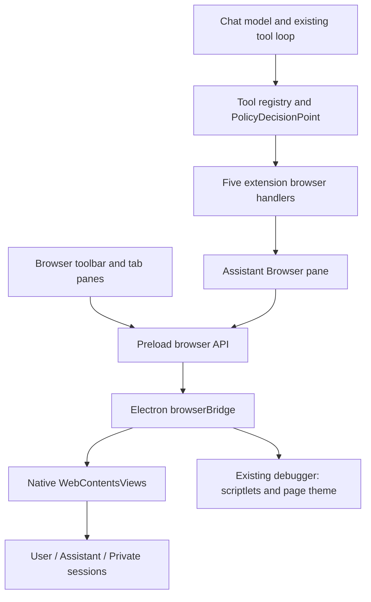
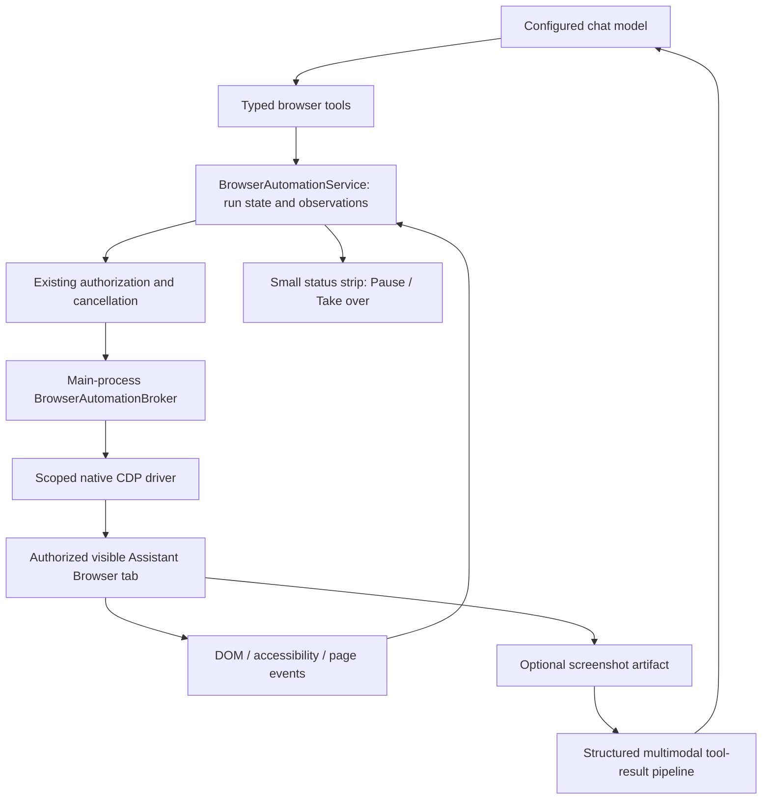

# Browser agent audit and build proposal

Date: 2026-09-10. Scope: the Browser extension, its Electron bridge, and the chat tool execution path. This began as an audit and proposed design, written before any production browser code changed. The implementation followed the same day; see [Implementation record](#implementation-record-2026-09-10) at the end. Tests used disposable profiles and synthetic pages; existing user workspaces and browser profiles were not opened by the probes.

**Implementation entry point:** read [BROWSER_AGENT_IMPLEMENTATION_CONTRACT.md](BROWSER_AGENT_IMPLEMENTATION_CONTRACT.md) first. It fixes the transport, tool names, file ownership, lifecycle integration, and cost defaults after the final cross-system review. This audit remains the evidence and task checklist; the contract governs implementation where an exploratory alternative below differs.

## Execution handoff: read this first

This document explains the design and evidence. The checklist below supplies the execution order. **Start with Task A, not with implementing every proposed tool.** Production implementation starts only when requested; this document is not itself an instruction to launch the whole project.

Terminology: CDP is Chrome DevTools Protocol; AX is the browser's accessibility tree; a driver sends browser commands; the broker checks which page a caller may control; an observation is a versioned reading of the page; a lease is host-issued permission for one run to control specified tabs.

### Fixed constraints

- Preserve the existing visible browser and app layout. Do not replace it with a separate hidden browser or add another AI planning loop.
- Use disposable app profiles and test workspaces under `test-results/browser-audit/`. Set profile/session paths before Electron becomes ready. Never point a test at an existing user profile or workspace.
- Do not modify Problem Bank, Worksheets, flashcards, or unrelated changes. Record `git status --short` before editing. Do not stage or commit other work.
- Read applicable repository instructions, then recheck each function, caller, and consumer before changing it. Line numbers in this audit are navigation hints, not stable identifiers.
- Preserve sandboxing, context isolation, separate profiles, and existing task authorization. Do not fix a fixture by weakening production permissions or disabling production protections.
- Use the installed dependency versions first. Do not assume a feature in newer online documentation is present locally.
- Later tasks depend on earlier gates. A failed gate means investigate and report the concrete failure; do not mark it passed or implement dependent features on an assumption. Independent authorized work may continue.

### Task A: resolve and measure transport compatibility

**Files to start from:** `tests/probes/browser-cdp-audit.cjs`, `electron/browserBridge.cjs`, `electron/browserPolicy.cjs`, and the native view caller in `ext/browser/main.js`. Change diagnostics first; do not redesign production code to make the experiment pass.

1. Reproduce the fixture load failure. Record the exact failing operation, URL, load events, renderer-exit details, and installed versions in a new result directory.
2. Separate harness failure from bridge behavior: compare a minimal isolated Electron view with the actual bridge using the same synthetic document. Inspect existing isolated Electron test helpers before inventing another launch configuration. If a local HTTP fixture is needed, serve only fixture files and explicitly permit only that fixture address.
3. Once the actual bridge loads the fixture, assert an AX button is found, native input produces a trusted click, and a screenshot contains the expected fixture. Merely obtaining bytes or setting `pass:true` is insufficient.
4. Extend assertions to frames, popup event/opener identity, existing scriptlet/theme behavior, and manual debugger detach/reattach feasibility. Production automatic recovery and broker ownership enforcement belong to Task B. The current probe records a popup boolean but does not assert it; it is not a complete acceptance suite.
5. Verify native CDP against the gate. Only investigate a Playwright adapter if a reproducible native-driver limitation requires an alternative. A whole-app connection is a diagnostic result, not an acceptable model-facing API.
6. Append transport evidence here: artifact paths, remaining limitations, and the exact broker integration seam. If native CDP cannot meet the gate, identify the failed requirement before changing the fixed design.

**Done when:** the transport has evidence for the Stage 1 gate below, and its isolation design is explicit. No framework comparison is required. A standalone Chromium pass cannot substitute for the actual Electron bridge.

### Task B: lock the contract and ownership boundary

Depends on A. Use the proposed architecture and tool table below. Reuse the existing service registration conventions after inspecting them; proposed service names are design names, not files already present.

Write the request/result types and their consumers together. The trusted invocation supplies run/workspace authority; model arguments supply only the requested operation and authorized references. Define error codes for stale target, wrong owner, timeout, load failure, cancellation, and unavailable page. Implement main-process validation and per-run serialization before exposing new actions. Test wrong-run, wrong-profile, closed-tab, and cancelled-command rejection. Preserve existing policy behavior for routine authorized actions.

**Done when:** a synthetic authorized request reaches only its owned page, invalid requests cannot dispatch input, and every typed error survives the chat bridge to a tool result.

### Task C: implement reliable actions through existing tools

Depends on B. Work in this order: host-owned target references; native/semantic input; event-driven waits; popup ownership; cancellation and crash handling. Keep existing tool names callable through wrappers. Add iframe, shadow-root, and rich-editor fixtures as their support lands.

Use `tests/probes/browser-agent-audit.mjs` to understand the failures, not as the new regression suite: it deliberately asserts broken behavior. New tests must assert correct outcomes. For the hidden-button case, an old reference must fail safely; a fresh reference must activate only the current button. A missing select option must return an error. A timeout must not return success. A popup must retain assistant profile and run ownership. Cancellation must prevent the next queued action, without claiming to undo requests already sent.

**Done when:** these regression cases and the relevant existing policy tests pass through the production integration. Source-string extraction alone is insufficient for the new implementation tests.

### Tasks D and E: complete the user flow, then add vision

**D depends on C:** implement the Stage 3 visible task flow, including user takeover, authentication handoff, tab changes, and download/dialog outcomes. Demonstrate one synthetic multi-page task in the actual app. Include a screenshot of the compact status UI and evidence that human input pauses automation.

**E depends on D:** implement structured tool images across the result type, adapters, loop, provider serialization, and history/UI. Test with a captured fixture image reaching the model-facing request. Then implement coordinate actions tied to its observation and verify zoom/DPI transformations. Do not advertise vision support based only on a screenshot saved to disk. Live model evaluation follows the Stage 5 plan and the user's provider authorization.

### Required completion report for each task

Report: task ID; changed files and purpose; exact checks run; results and artifact paths; unresolved failures; and the next eligible task. Mark each item `not started`, `in progress`, `passed`, or `blocked`, with evidence for `passed`. Do not carry forward the audit's 29 passing tests as proof of newly changed behavior. For production changes run the repository build and relevant regression checks; assess broader checks from the actual affected callers. Do not launch the normal app against a user workspace merely to verify a build.

## Recommendation

Keep Parallx's visible embedded browser. Replace the five tools' execution internals with a typed browser automation service that observes the current page, performs a scoped action, and verifies the result. Use DOM and accessibility information first, with screenshot-based interaction as a later fallback.

The browser shell already provides useful infrastructure: native page views, separate session partitions, navigation events, downloads, permissions, and an existing Chrome DevTools Protocol connection. The weak point is the AI execution layer. Its element identifiers can select the wrong element, its actions only approximate user input, and its waits can report success on timeout. Adding more tools or changing the prompt without fixing these foundations would make failures harder to diagnose.

The final design uses a main-process broker sharing the existing debugger connection, with native CDP as its transport. Playwright remains the test driver. Verify the native transport on actual embedded views before implementing dependent features; that compatibility has **not** been established in this audit. Reconsider the transport only for a demonstrated unmet requirement.

## How the current browser is built



| Layer | Current responsibility and source |
| --- | --- |
| Extension registration | [Manifest](../ext/browser/parallx-manifest.json), version 0.3.0: activation, commands, toolbar contributions, and settings. |
| Browser UI | [main.js](../ext/browser/main.js): address bar, panes, history, bookmarks, downloads, reader, shields, editor lifecycle, and AI handlers. Roughly the first 2,075 lines are extension code; the remainder includes bundled Readability. Some comments still describe the old webview implementation. |
| App-to-main transport | `V()` at main.js:431 calls the [preload browser API](../electron/preload.cjs), which forwards IPC methods. |
| Native browser ownership | [browserBridge.cjs](../electron/browserBridge.cjs):427 creates `WebContentsView`s and retains them by tab ID. Renderer panes supply bounds and visibility; moving a pane need not recreate its page. |
| Session policies | [browserPolicy.cjs](../electron/browserPolicy.cjs) plus bridge setup: URL handling, permission decisions, cookies, popups, and downloads. |
| Persistent extension state | [Initial browser migration](../ext/browser/db/migrations/browser_001_initial.sql): bookmarks, history, downloads, and tabs. |
| AI registration | main.js:1994 registers `browserOpen`, `browserRead`, `browserClick`, `browserType`, and `browserBack`, through [chatBridge.ts](../src/api/bridges/chatBridge.ts). |

Page renderers use sandboxing and context isolation, without Node integration. Sessions are separated into persistent user and assistant partitions and a nonpersistent private partition. The bridge configures blocking lists, cookie filtering, HTTPS upgrades with local-address exceptions, and permission handling. These are useful foundations, not substitutes for ownership checks on automation commands.

Native views sit above the app DOM. The renderer uses layout tracking and overlay hit tests; when app overlays intersect, it can snapshot and hide the native page. That matters for automation: screenshot coordinates, actual view visibility, app menus, and user takeover need a shared definition of which page is actionable.

The assistant uses a single `agent:main` pane. Reading runs a page script that enumerates selected top-level links, buttons, and inputs, then extracts readable text with Readability. Clicking calls DOM `.click()`. Typing assigns `.value` and dispatches synthetic events. Actions wait for page loading and return another reading. “Send Page To Chat” separately stages the title and URL; it does not attach the current live DOM.

## Findings, ordered by importance

“Reproduced” below means the actual extracted extension code ran against synthetic Chromium documents, not a full Electron end-to-end session. “Source trace” means implementation plus its callers/consumers were inspected. Neither label implies that a hostile website exploited the app.

| Priority | Finding and consequence | Evidence |
| --- | --- | --- |
| P0 | **Element references can target the wrong element.** Reads assign `data-px-i` again without removing previous attributes. A previously indexed button becomes hidden; a new read reports another button at index 0; clicking 0 still selects the hidden old button. This is an action-correctness blocker. | Reproduced: reported “Current action,” clicked `old`. main.js:1898, 1947. |
| P0 | **Agent popup routing loses the agent profile.** The bridge forwards an allowed popup with its opener ID. The renderer checks only `isPrivate`, then opens a normal user tab for a nonprivate agent opener. The agent remains on the old page while the destination can load with the user's session. | Source trace through bridge popup handler, main.js:1711 and `openTab`; extracted routing branch reproduced `{private:false}`. Full native popup sequence remains unverified. |
| P1 | **Waits obscure failure and add latency.** Timeout resolves `true`; action callers do not make load failure a reliable error. Registering the waiter after the action can miss a fast event. A click that only updates a SPA can wait the full timeout. | Timeout returning success reproduced from actual `waitLoad`; source trace main.js:724 and agent wait callers. |
| P1 | **Input is not faithful to browser interaction.** `.click()` produces a synthetic click without the normal pointer/mouse sequence. Value assignment is not a general implementation of checkboxes, selects, or framework-controlled fields. | Reproduced synthetic versus Playwright event sequences. Checkbox remained unchecked; nonexistent select option still reported success. main.js:1947, 1961. Controlled-framework behavior needs separate fixtures. |
| P1 | **Target coverage and identity are incomplete.** The same anchor with `role=button` receives two indices, invalidating one. Enumeration misses the fixture's iframe button, shadow button, and contenteditable textbox. Visibility does not establish that a target is on screen or unobstructed. | All fixture cases reproduced. main.js:1898. An offscreen target was listed; there is no click-time hit-test in the current handler. |
| P1 | **One global agent pane has no run ownership.** Tool handlers ignore their provided cancellation and invocation context. Multiple conversations can operate the same page; the core's sequential loop within one run does not serialize separate runs. | Source trace main.js:1858 onward; [tool service](../src/services/languageModelToolsService.ts) and [tool loop](../src/openclaw/openclawAttempt.ts). Concurrency race not exercised end to end. |
| P1 | **The UI's confirmation promise differs from runtime policy.** Click/type declare confirmation, but the existing policy can allow ordinary consequential tools during user-initiated tasks. “Always asks” is therefore not the actual guarantee. | Source trace registration → tool service → [PolicyDecisionPoint](../src/services/policyDecisionPoint.ts):221; initiator policy tests pass. Fix the promise and use task authorization, rather than interrupting every click. |
| P1 | **Password exclusion is advisory.** Tool wording says not to enter passwords; the handler accepts password inputs. A model instruction is not an enforced credential boundary. | Synthetic password input accepted the fixture value. main.js:1961 and tool description. |
| P1 | **Vision cannot simply be plugged into the existing tool result path.** `IToolResult` carries a string; the MCP bridge filters out non-text content, and the loop formats tool results as text. | [chatTypes.ts](../src/services/chatTypes.ts):1018; [mcpToolBridge.ts](../src/openclaw/mcp/mcpToolBridge.ts):88; openclawAttempt.ts tool-result handling. User image attachments do not solve tool-image delivery. |
| P2 | **Assistant persistence is only partly separated.** Its cookies are separate but persistent. History/tab writes exclude private panes, not agent panes. The normal clear action clears the user browser partition. | Source trace partition creation, main.js:743/1212/1838, and database schema. Separate cookies should not be described as a fresh or fully separate activity history. |
| P2 | **Agent downloads use ordinary download destinations.** Main-process download handling chooses workspace Downloads or OS Downloads for all kinds. There is no agent-run artifact lifecycle on this path. | Source trace browserBridge.cjs:359, session download registration, and extension download persistence. |
| P2 | **The privileged bridge is broader than an agent API should be.** It exposes raw JavaScript execution and general tab operations; the IPC handler does not validate the sender or an agent ownership capability. | browserBridge.cjs:498–537 and preload forwarding. This is a privileged app-renderer API, not proof that guest web content can call it. Do not expose it directly to the model. |
| P2 | **Debugger and crash lifecycle need explicit ownership.** Scriptlet injection and theme changes already use `webContents.debugger`. The current view event forwarding does not provide an agent-specific renderer-crash recovery contract. | Source trace bridge view setup, `refreshScriptlets`, theme handler, and renderer event consumers. A second debugger owner could disrupt existing features. |

## Technology choice

| Option | Useful role in Parallx | Decision |
| --- | --- | --- |
| Playwright library | Reliable browser interaction primitives and deterministic browser tests. | Use for tests; reserve production attachment as a fallback requiring evidence. Electron support is experimental, and CDP attachment has lower fidelity than Playwright's own protocol. It is not a verified drop-in for these views. [Electron support](https://playwright.dev/docs/api/class-electron), [CDP attachment](https://playwright.dev/docs/api/class-browsertype#browser-type-connect-over-cdp). |
| Playwright MCP | Existing design for exposing browser actions and structured accessibility snapshots to a model. | Strong reference for observation/tool design; MCP is a tool interface, not an isolation boundary. Avoid starting a separate invisible browser merely to make integration easy. [Official repository](https://github.com/microsoft/playwright-mcp). |
| Electron debugger / CDP | In-process commands against the exact embedded page already owned by the app. | Preferred transport starting point. Centralize debugger ownership and domain subscriptions. Electron documents debugger detachment when DevTools opens; recovery must restore required state. [Debugger API](https://www.electronjs.org/docs/latest/api/debugger). |
| Chrome DevTools MCP | Browser diagnostics, console/network inspection, and debugging. | Useful development tooling and design reference; the full diagnostics surface is broader than the user's browser-task toolset. [Chrome announcement](https://developer.chrome.com/blog/chrome-devtools-mcp). |
| Stagehand | Higher-level `act`/`observe` APIs and model-assisted element selection. | Consider later for a bounded comparison. Parallx already has a planning loop; avoid adding another model-driven planner by default. [Act](https://docs.stagehand.dev/v3/basics/act), [Observe](https://docs.stagehand.dev/v3/basics/observe). |
| Screenshot-based computer use | Visual interpretation and mouse/keyboard actions for inaccessible or canvas interfaces. | Fallback after structured tool-image delivery exists. Scope capture and input to the browser page. [Computer-use tool architecture](https://platform.claude.com/docs/en/agents-and-tools/tool-use/computer-use-tool). |
| WebMCP | Participating websites expose structured actions directly, reducing the need to infer every interaction from the DOM. | Optional future fast path. Chrome currently documents a proposed standard and origin trial; do not assume support in the installed Electron runtime or across websites. Site-provided actions still need Parallx authorization. [Chrome documentation](https://developer.chrome.com/docs/ai/webmcp/). |

Installed versions inspected: Electron **40.2.1**, Playwright **1.58.2**. Online documentation contains newer APIs; implementation must check the pinned versions before using them.

The difficult tradeoff is maintenance. Native CDP fits the current view ownership but does not automatically supply Playwright's actionability, frame handling, retries, or diagnostics. The acceptance fixtures define the required support; implementing a general replacement for all of Playwright is outside scope. An unrestricted browser-level CDP endpoint could expose the app and user tabs. Electron's debugger object is not a documented drop-in transport for Playwright's public connection API.

## Proposed architecture



### Observe, act, verify

Every action follows: **observe → choose → authorize and revalidate → act → wait for a meaningful condition → observe**.

Observations contain a compact page summary and actionable targets with role, accessible name, state, frame, and geometry. IDs are opaque references owned by the host, tied to run, tab, document, frame, and observation. Do not use page-editable attributes as authority. Before acting, confirm the referenced node is still the intended connected target and is enabled, visible, and reachable. Return `STALE_TARGET` with a fresh observation when that cannot be established; never silently choose a replacement for a consequential action.

Support frames and open shadow roots explicitly. Track navigation and relevant mutations rather than invalidating every reference on every animation. Accessibility trees and DOM inspection complement one another; neither guarantees complete coverage of arbitrary canvas interfaces.

Use native input or validated browser automation primitives. Distinguish click, fill, check, select, key press, hover, and scroll. A valid call means the requested interaction occurred; task success additionally requires evidence of the expected result. Do not blindly retry submissions when their outcome is unknown.

Arm relevant event observers before an action. Wait for conditions such as a target appearing, URL changing, text updating, a download starting, or a dialog opening. Return explicit timeout/load-failure/cancelled states. Avoid a fixed sleep or universal network-idle requirement for dynamic sites.

“Real time” means the user sees the actual page change and receives current action status while the model works. It does not require continuously streaming screenshots to the model. Prefer compact observations and changes; capture images when needed.

### Ownership and user control

The host creates a run lease containing workspace, run, authorized profile, owned tabs, scope, and expiry. The model receives references, not authority to mint a lease or select arbitrary app web contents. The main process validates the caller and ownership for every action. One active automation run holds the assistant-profile lock; competing runs receive an explicit busy result. The active run may own several tabs.

Propagate cancellation into waits and queued commands. Pause automation on human input, workspace transition, run disposal, or loss of a valid page. Cancellation stops future actions; it cannot undo a request already sent to a website. Existing sealed-workspace policy should revoke agent leases without changing the intentional distinction between agent browsing and ordinary user browsing.

Use the current PolicyDecisionPoint and the user's task authorization. Routine navigation within that authorization should proceed without repeated confirmations. Actions that commit an unapproved purchase, send a message, or otherwise exceed scope need a concrete review/handoff. Page instructions and site-declared tool descriptions are untrusted content, not new user instructions.

Popups inherit the opener's run and assistant profile. Give them explicit tab identities and report them to the planner. Authentication happens through a visible user handoff in the assistant profile; do not silently copy the user's regular cookies. Make persistent assistant login state and clearing it understandable. Credentials should stay out of model-visible arguments and observations where a local credential handoff can be used.

Downloads belong to an owned artifact directory until export. Uploads use explicit file handles selected for the task, not arbitrary filesystem paths. Handle completion, interruption, and dialogs as first-class states.

Keep the UI restrained: the existing browser page, a compact current-action indicator, and Pause/Take over controls. Put detailed action traces behind disclosure. The agent should not fight the user for control or create a second dashboard over the page.

### Tool contract

The final review retains existing names to avoid duplicate schemas and migration complexity. Detailed arguments and registration ownership are defined in the implementation contract.

| Tool | Responsibility |
| --- | --- |
| `browserOpen`, `browserBack` | Open/navigate or go back with a typed outcome and implicit scoped lease. |
| `browserRead` | Read a page, region, or target; return versioned references and relevant changes. |
| `browserClick`, `browserType` | Preserve existing names with reliable click/fill behavior. |
| `browserAct` | Typed union for additional actions: check, select, press, hover, scroll. |
| `browserTabs` | List, switch, and close owned tabs. |
| `browserWait` | Wait for a bounded observable condition. |
| `browserCapture` | Return a screenshot artifact with viewport, zoom, scale, and observation metadata. |

Retain the existing five names as wrappers around the new service. Add file/dialog operations through explicit scoped contracts when those flows ship. Do not expose arbitrary JavaScript, arbitrary CDP commands, or enumeration of every app tab as ordinary agent tools.

Results distinguish `ok`, `needs_user`, `cancelled`, and `error`, and include tab/document/observation IDs, URL, verified changes, timing, and typed error codes. Actions do not continue executing in the background after returning a tool result. Structured JSON inside today's text result can support the first phase.

Vision requires a separate core change: structured image/artifact tool results, provider serialization, history persistence, retention limits, and UI rendering. The current MCP adapter must preserve image blocks. Do not stuff base64 into text. Capture metadata must bind coordinate actions to the correct viewport and current observation; account for zoom and display scale.

Use the user's configured tool-capable model. Enable the visual path only when the selected provider supports it. This audit did not evaluate any live model; reliable execution and model planning quality need separate measurements. Continue using search/fetch for ordinary retrieval where a live interactive session adds no value.

## Build sequence and acceptance gates

| Stage | Deliverable | Exit gate |
| --- | --- | --- |
| 1. Prove the transport | Disposable Electron fixture using native CDP and the actual bridge. | The fixture view supports accessibility reading, trusted input, capture, frames, and popup events; scriptlet/theme coexistence and manual detach/reattach are demonstrated. Scope diagnostic commands to the fixture. Production broker enforcement/recovery belongs to Stage 2. Resolve the failed fixture before building dependent features. |
| 2. Replace fragile execution | Typed service/broker; stable refs; semantic inputs; truthful waits; run ownership and cancellation; correct popup profile. | All reproduced failures become passing regression cases. Existing five tools work through the new service. No further queued action after cancellation; stale targets never silently click another element. |
| 3. Ship complete visible task flows | Multitab tasks, Pause/Take over, authentication handoff, dialog/download lifecycle, compact trace and errors. | Deterministic end-to-end tasks finish in the visible browser; intervention and recovery work without losing the session or crossing profiles. |
| 4. Add visual fallback | Multimodal tool artifacts and scoped screenshot/coordinate actions. | Actual model receives the screenshot; coordinate transforms verified across zoom/DPI; visual fallback succeeds on an otherwise inaccessible fixture. |
| 5. Measure model usefulness | Small repeatable task suite across selected providers and representative allowed sites. | Report task success, wrong actions, timeouts, recovery rate, latency, tokens, and intervention frequency. Set deployment thresholds from the baseline rather than inventing a success claim. |

Fixtures should include reordering/hidden targets; duplicate roles; controlled inputs; contenteditable; checkbox/select semantics; iframes and shadow roots; SPA and full navigation; popups; dialogs; downloads; renderer failure; concurrent runs; user takeover; cancellation; page-injected instructions; and profile/lease boundaries. Use synthetic fixtures first, then explicitly chosen real sites. Do not test consequential actions against live user accounts.

This is several distinct pieces of engineering, not a one-file tool addition. Stage 1 gives the information needed for a credible implementation estimate; Stage 2 fixes correctness before expanding autonomy. Stages 3 and 4 provide the visible product experience and broader website coverage.

## Audit evidence and limitations

Existing tests executed: **29 passed** — 12 browser-policy, 13 initiator-policy, and 4 sealed-workspace tests. These verify their respective rules; they do not cover the newly reproduced execution problems.

```powershell
node node_modules/vitest/vitest.mjs run tests/unit/browserPolicy.test.ts
node node_modules/vitest/vitest.mjs run tests/unit/policyDecisionPointInitiator.test.ts tests/unit/sealedWorkspace.test.ts
node tests/probes/browser-agent-audit.mjs
```

The [page-script diagnostic](../tests/probes/browser-agent-audit.mjs) extracts current source expressions and exercises them in a fresh network-blocked Chromium context. Its assertions deliberately confirm existing defects; this is an audit reproducer, not a passing regression suite for corrected behavior. Result: `test-results/browser-audit/agent-c6rgSW/result.json`.

The [native transport diagnostic](../tests/probes/browser-cdp-audit.cjs) uses a disposable Electron profile and the actual bridge. It failed loading its fixture with `ERR_FAILED (-2)` before reaching accessibility, native-input, or screenshot assertions. Latest failure: `test-results/browser-audit/cdp-4YdPtX/failure.txt`. The cause remains undetermined. This failure proves neither that CDP is incompatible nor that the proposed integration works. The shell exit code was insufficient to establish success; the failure artifact is the result.

No live-model evaluations, production website transactions, full native popup reproduction, or performance benchmark were completed. No production fixes are claimed. Source conclusions were checked across implementations, registrations/callers, and downstream tool/policy consumers; runtime findings and unverified compatibility questions are separated above.

## Implementation record (2026-09-10)

Implemented the same day against [the contract](BROWSER_AGENT_IMPLEMENTATION_CONTRACT.md), on branch `browser`, uncommitted. Every runtime check ran on the **actual app** (throwaway app root and workspace, local HTTP fixtures on two origins, nothing leaving the machine), through the real tool handlers, core service, preload, main-process broker and each page's own debugger. The audit's 29 earlier tests are not counted as evidence below.

### How it is built now

| Layer | Now |
| --- | --- |
| Tools | Nine tools (`browserOpen`, `browserRead`, `browserClick`, `browserType`, `browserBack`, `browserAct`, `browserTabs`, `browserWait`, `browserCapture`) registered by the core [BrowserAutomationService](../src/services/browserAutomationService.ts) with owner `parallx.browser`, source `bridge`, only while the Browser extension is registered as host. Extension enablement, the seal filter and the PolicyDecisionPoint apply as for any extension tool. `browserClick`, `browserType` and `browserAct` declare confirmation; the PDP decides. |
| Identity | From the invocation, never from arguments: chat session (invocation context), request id (the turn's cancellation token), workspace session (session manager). The chat service fires `onDidCompleteRequest` on every ending, which releases the lease. |
| Host | The extension registers through `parallx.browser.registerAutomationHost` ([bridge](../src/api/bridges/browserAutomationBridge.ts), defined for `parallx.browser` only, tied to its subscriptions). It shows broker-created tabs, the run state and Pause / Take Over / Hand Back / Stop; it cannot start a run or act on a page. The old Section 11 handlers and `agent:main` are gone. |
| Broker | [browserAutomationBroker.cjs](../electron/browserAutomationBroker.cjs), main process, one IPC channel that accepts only the main window's main frame. One lease per assistant profile (another chat gets `BROWSER_BUSY`); leases end with the turn, cancellation, a workspace change, sealing, a renderer reset or the host going away. |
| Driver | One [debugger controller](../electron/browserDebugger.cjs) per view, shared with scriptlets and page theme; every command time-boxed; state restored after DevTools detaches it. |
| Observation | Accessibility tree across the main frame, same-process frames and out-of-process frames (auto-attached sessions); one reference per node; references bound to tab, frame, session, document (loaderId), node, role, name and observation; secret fields never show values; results fitted to the chat's per-call budget as valid JSON. |
| Actions | Trusted mouse and key events and `Input.insertText`; re-resolve and recheck before acting (`STALE_TARGET`, never a swap); scroll, hit test and `OBSCURED`; watchers armed before the action; outcomes `navigated`, `page-changed`, `no-visible-change`, `popup`, `download`, `dialog`, `LOAD_FAILED`, `NAVIGATION_TIMEOUT`, `TIMEOUT`. |
| Images | `IToolResult.artifacts` (ids) and `IToolResult.images` (this turn only). The loop sends a tool's images to a model with vision as one user message after the results; newer images replace older ones within the turn; the tool card and history keep ids only, and the card loads a thumbnail by id. The MCP bridge keeps image blocks. |

### Findings, now

| Finding | Status | Evidence |
| --- | --- | --- |
| P0 wrong element | passed | `staleReplacedRefused`, `staleHiddenRefused`, `duplicateRoles`, `unknownRefRefused` |
| P0 popup profile | passed | `popupAgentTab`: popup is a second assistant tab, agent partition, owned, no user-tab request |
| P1 waits | passed | `timeoutIsError`, `downloadInArtifacts`, `multiPageTask`; a download link is no longer a navigation timeout |
| P1 input fidelity | passed | `checkbox`, `select` (missing and disabled options refused), `typeText`, `contentEditable` |
| P1 target coverage | passed | `crossFrame` (out-of-process iframe), `shadow`, `contentEditable`, `obscuredRefused` |
| P1 run ownership | passed | `busy`, `cancellation` (ends within 100 ms), `staleWorkspace`, `workspaceRevokes`, unit tests |
| P1 confirmation promise | passed | Banner now says clicks and typing follow the chat's approval settings; the PDP stays the authority |
| P1 password | passed | `passwordRefused`: `needs_user` / `PASSWORD_FIELD`, the field stays empty, the target shows no value |
| P1 vision path | passed at the loop and provider boundary; no live model | Unit tests: `openclawToolImages`, `anthropicToolImages`, `mcpToolBridgeImages`, service capture test; probe `artifactReadable` (JPEG) |
| P2 persistence | passed | Assistant tabs never write History or Tabs; **Clear Assistant Browser Data** clears the agent partition only |
| P2 downloads | passed | `downloadInArtifacts`: `userData/browser/artifacts/<workspace>/<run>/downloads/`, kept out of the user's download list |
| P2 broad bridge | passed | `browser:view` and `browser:automation` refuse any sender but the main window's main frame; the model gets no JavaScript or protocol access |
| P2 debugger lifecycle | passed | Transport probe `detachReattach`; controller restores domains, scriptlets, emulated media and auto-attach |

### Completion reports

**Task A (transport): passed.** Files: `tests/probes/browser-transport-probe.mjs`. Check: `node tests/probes/browser-transport-probe.mjs` on the actual app. Result: 8 of 8 gates (AX main and frames, trusted input, capture, popup event with opener id, document-start scripts, page theme coexisting, detach and reattach). Found: `Page.captureScreenshot` never answers in a hidden window (no frames), so capture uses `webContents.capturePage()`; matchMedia listeners need a frame, so theme is read from `.matches`.

**Task B (contract and ownership): passed.** Files: `electron/browserDebugger.cjs`, `electron/browserAutomationBroker.cjs`, `electron/browserBridge.cjs` (controller per view, sender checks, agent requests cancelled while sealed, popup and download routing, input pause hook), `electron/preload.cjs`, `src/services/browserAutomationTypes.ts`, `src/services/browserAutomationService.ts`, `src/api/bridges/browserAutomationBridge.ts`, `src/api/apiFactory.ts`, `src/api/parallx.d.ts`, `src/workbench/workbenchServices.ts`, `src/services/chatService.ts` (`onDidCompleteRequest`), `src/services/chatTypes.ts`, and the per-call `resultCharBudget` threaded through `languageModelToolsService.ts`, `openclawAttempt.ts`, `openclawTypes.ts`, `openclawReadOnlyTurnRunner.ts`, `src/built-in/chat/chatTypes.ts`, `chat/main.ts`, `chatDataService.ts` and the three participants. Checks: `npx tsc --noEmit`, `npm run build`, unit tests `browserAutomationService` (14), `browserAutomationBroker` (10), `chatServiceCompletion` (3).

**Task C (reliable actions): passed.** Files: the broker and `ext/browser/main.js` (host rewrite: Section 11 replaced; assistant tabs adopt their owned page and never load the homepage, show an ended message when the page is gone, stay out of History and Tabs, count toolbar use as taking over; reconcile skips owned views still being opened; assistant popups and downloads never reach the user's tabs or download list; new command **Clear Assistant Browser Data**). Check: `node tests/probes/browser-regression-probe.mjs` (hidden). Bugs the probe found and fixed on the way: a never-navigated tab stalled every protocol command (load first; `NO_PAGE` guard); `browserOpen` and `browserBack` watched a copy of the event record and always timed out; a click that opens a dialog blocked on the input command; a download link was reported as a navigation timeout; fitting dropped targets but then added the cursor and overflowed; cancellation waited on an in-flight page check.

**Task D (visible flow): passed, hidden and visible.** Final runs, 30 of 30 gates each: hidden `test-results/browser-audit/regression-mtvzbxk0/`, visible (the user watching) `test-results/browser-audit/regression-mtvz92mt/` with real-window photos `window-running.png`, `window-paused.png`, `window-popup.png`, `window-dialog-open.png`, `window-after-dialog.png`, `window-task-done.png`. Multi-page task (open, follow a link, fill a form, submit, read "Thanks, Grace Hopper.") through the tools alone; takeover by real input pauses the run (`USER_TOOK_OVER`), the banner shows **You Have Control** with **Hand Back** and **Stop**, and hand back resumes; two tabs; download and dialog outcomes. Status strip screenshots: `status-running.png`, `status-paused.png`.

**Task E (vision): passed except a live model.** `IToolResult.images` end to end through the loop and the Anthropic and Ollama serializations; thumbnails on the tool card; MCP image blocks kept; capture artifacts as JPEG under 1 MB; `click_at` hit its target at 150% page zoom on a 1.5 display scale (`clickAtZoom`). Not done: a live model receiving a capture (Stage 5, the user's provider authorization).

### Open items

- **Page dialogs (corrected).** A page's `confirm` closed with Cancel within about 75 ms in both probe runs. The completeness review traced this to the test harness: Playwright dismisses page dialogs itself when a test has no dialog listener. It is not app behaviour, and the user's own tabs are not affected. The probe now keeps its hands off dialogs, so the broker's answer path is what the gate measures. Meanwhile the outcome says so (`dialog-closed: Cancel`) and `browserAct dialog` answers `NO_DIALOG` with how the last one closed. If the debugger cannot answer a dialog, the tool returns `needs_user` / `DIALOG_NEEDS_USER`.
- **Not exercised by the probes:** approval prompts (the probes call handlers directly; which tools confirm is unit-tested), an authentication handoff on a real login, a page renderer crash, and the ended message on a restored assistant tab.
- **Stage 5** (model usefulness) has not started.

### Completeness review and fix pass (2026-09-10, later)

The record above was written after the first 30-gate probe passed. A completeness review then read the work against this audit and the contract. Seven independent reviewers covered: the contract, the broker's correctness, security and isolation, chat and vision, the extension host and UI, page dialogs, and test coverage. They reported 82 raw findings, which merged into 62. One skeptic per finding then tried to refute it against the code: **51 confirmed, 11 refuted**. Among the refuted: the claim that assistant tabs show a native dialog box (they do not), and the claim that a hostile page can reach the other `browser:*` handlers.

Confirmed and fixed in the fix pass (46 verified by read-only skeptics afterwards):

- **Stop.** Stop now ends the whole request (`STOPPED_BY_USER`), not just the current step.
- **User control.** Cancel, Stop, Take Over and the user's own input are rechecked before every input event.
- **Result size.** Results are held to 12,000 characters, and action outcomes carry a short text excerpt. Paging cursors are correct, and long page text can be read on with `textFrom`.
- **Downloads.** Downloads outside a live run no longer land in the user's folder. Sealing or a workspace change cancels the assistant's downloads.
- **Pickers and prompts.** File inputs return `FILE_CHOOSER_NEEDS_USER` instead of opening a picker modal to the app. A beforeunload veto is handled: `LEAVE_BLOCKED` for the assistant, and a Leave / Stay box for the user. HTTP sign-in prompts show a bar in the tab, and the assistant gets `AUTH_NEEDS_USER`.
- **Crashes and closed tabs.** A crashed page reports `PAGE_CRASHED` at once. Closing an assistant tab mid-run pauses the run instead of reopening the tab.
- **Private addresses.** Loopback, LAN and link-local addresses are refused (`PRIVATE_ADDRESS`; the probes allow their own fixture hosts through `PARALLX_BROWSER_AGENT_ALLOW_LOCAL`).
- **Profile permissions.** The assistant profile no longer auto-allows fullscreen and clipboard writes.
- **Hidden values.** Card, CVC and expiry values are hidden like passwords.
- **Captures.** They are gated on the loop that will deliver the image (`acceptsImages`), survive mid-loop compaction, and are cleared with Clear Assistant Browser Data and with chat deletion.
- **Workflows.** Workflows refuse the browser tools clearly instead of failing without a turn.
- **Reveal.** Revealing an assistant tab focuses it instead of duplicating it, and takeover is detected at every navigation path.
- **Smaller action fixes.** `#fragment` opens, aborted navigations, stale `browserWait` downloads, disabled targets, hover and dialog evidence, and `click_at` validation.

The first probe also measured something wrong, and the record above repeated it. The "confirm closed with Cancel in 75 ms" came from Playwright auto-dismissing dialogs, not from the app. With the probe no longer touching dialogs, a page `confirm` in an assistant tab stays open until the broker answers it. The probe grew to 60 gates.

The fix pass also exposed a bug that had been there since the first version: the hit test was given viewport coordinates, so on any scrolled page clicks were refused as `OBSCURED`. The first probe never caught it because its fixture never scrolled. That bug and seven smaller leftovers are the residual pass below.

### Residual pass (2026-09-11)

- **Scrolled pages.** `DOM.getNodeForLocation` takes document coordinates; the hit test now adds the frame's own scroll. Iframe positions come from content quads (viewport coordinates) instead of the box model (page coordinates, off by the scroll). An out-of-process frame's missing parent id is taken from the tree that holds it.
- **Moving targets.** Before acting, two readings of the click point about 60 ms apart must agree. Scrolling a cross-process frame into view moves the page around it asynchronously.
- **Presses into cross-site frames.** A press over an out-of-process iframe goes to that frame's own session, in its own coordinates. Routed from the page, it landed on the `<iframe>` element once the page itself had been clicked. The probe recorded this at (78, 216): the page received it, the frame did not.
- **Downloads.** A name an unfinished download holds, or a `.crdownload` file on disk, is taken, so two same-named downloads no longer share a file. There is a unit test.
- **File chooser.** Interception is on only while an assistant action runs, and off on the user's own input.
- **Smaller fixes.**
  - The app-shortcut check receives the key event.
  - `clearArtifacts` announces `artifacts-cleared`, and thumbnails on screen show "Capture expired".
  - The service requires the chat completion and deletion events.
  - The dialog wait and comments built on the misdiagnosis are gone.
- **Final results.** Regression probe: 60 of 60 gates at 100% (`test-results/browser-audit/regression-mtwyklsz/`) and 60 of 60 at a forced 150% display scale (`regression-mtwyn4ct/`). Transport probe: 8 of 8 (`transport-mtwy4r4k/`). Unit suite: 382 files, 6,162 tests passed. `tsc` and `npm run build` are clean. Still open: a live model driving the tools on a real site (Stage 5), and a "Choose File" control for uploads (today the user takes over the tab and picks the file).
- **The probe.** Click gates now start from a scrolled page, and a `--scale=<n>` option runs at a forced display scale. `--only=<steps>` runs setup plus the named steps. The probe also no longer lists native windows. That helper ran PowerShell with an encoded command calling user32, and Norton's behavioural protection blocked it as a malware pattern on 2026-09-11.
