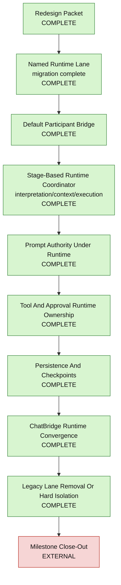

# Parallx Claw Implementation Tracker

**Status date:** 2026-03-25  
**Purpose:** Provide one visual source of truth for what is complete, what is actively being migrated, what is not started, and what remains blocked outside code.

---

## 1. How To Read This File

This file is the anti-drift status board for the claw redesign.

Status meanings:

- `COMPLETE` = implemented and locally verified
- `ACTIVE` = partially implemented or explicitly in migration
- `TODO` = planned but not yet implemented
- `EXTERNAL` = non-code blocker or approval outside the current code path

This file should be updated whenever a claw-runtime milestone slice changes the
real implementation state.

---

## 2. Visual Board

---

## 3. Implementation Board

| Workstream | Status | What is true right now | Primary files |
|------------|--------|------------------------|---------------|
| OpenClaw rebuild directive | `COMPLETE` | Default AI work is no longer supposed to continue inside the Parallx-native claw lane; a separate OpenClaw implementation root now exists under `src/openclaw/`, the main chat, `@workspace`, and `@canvas` surfaces now have OpenClaw-backed live lanes, bootstrap injection follows the OpenClaw fixed-file contract with missing-file markers and bootstrap-budget accounting, the frozen claw lanes remain preserved under explicit comparison aliases, the OpenClaw default lane now owns its runtime support path through `src/openclaw/openclawDefaultRuntimeSupport.ts`, the legacy-backed compatibility backbone has been removed, legacy early-command code no longer imports OpenClaw context handlers, and OpenClaw services are assembled through OpenClaw-owned builders instead of `ChatDataService.build*ParticipantServices()` for the live OpenClaw lane. | `docs/clawrallx/PARALLX_OPENCLAW_REBUILD_DIRECTIVE.md`, `docs/clawrallx/PARALLX_OPENCLAW_DISENTANGLEMENT_PLAN.md`, `src/openclaw/openclawDefaultRuntimeSupport.ts`, `src/openclaw/participants/openclawDefaultParticipant.ts`, `src/openclaw/participants/openclawWorkspaceParticipant.ts`, `src/openclaw/participants/openclawCanvasParticipant.ts`, `src/openclaw/participants/openclawParticipantRuntime.ts`, `src/openclaw/participants/openclawContextReport.ts`, `src/openclaw/openclawParticipantServices.ts`, `src/openclaw/registerOpenclawParticipants.ts`, `src/built-in/chat/main.ts`, `src/built-in/chat/utilities/chatDefaultEarlyCommands.ts`, `src/aiSettings/unifiedConfigTypes.ts` |
| Redesign packet | `COMPLETE` | The durable redesign/architecture packet exists under `docs/clawrallx/` | `docs/clawrallx/*` |
| Runtime lane naming | `COMPLETE` | The migration introduced an explicit runtime seam and the default participant now runs on a claw-only runtime contract after the legacy branch collapse | `src/built-in/chat/chatTypes.ts`, `src/built-in/chat/utilities/chatDefaultParticipantRuntime.ts` |
| Default participant bridge | `COMPLETE` | The default participant is a thin bridge over the runtime utility, not the main orchestration owner | `src/built-in/chat/participants/defaultParticipant.ts` |
| Runtime coordinator | `COMPLETE` | The claw runtime is split into explicit interpretation, context, and execution stages | `src/built-in/chat/utilities/chatDefaultParticipantRuntime.ts`, `src/built-in/chat/utilities/chatDefaultRuntimeInterpretationStage.ts`, `src/built-in/chat/utilities/chatDefaultRuntimeContextStage.ts`, `src/built-in/chat/utilities/chatDefaultRuntimeExecutionStage.ts` |
| Shared interpretation contract | `COMPLETE` | Default, workspace, canvas, and bridged metadata use the shared typed interpretation model | `src/built-in/chat/utilities/chatDefaultTurnInterpretation.ts`, `src/built-in/chat/utilities/chatTurnPrelude.ts` |
| Default chat surface crossover contract | `COMPLETE` | The repo now has an explicit execution contract for demoting workflow semantics on the main chat surface so planner hints stop acting as semantic authority for default-chat answers | `docs/clawrallx/PARALLX_DEFAULT_CHAT_SURFACE_CROSSOVER_CONTRACT.md` |
| Post-migration runtime gap diagnosis | `COMPLETE` | The repo now has a user-readable diagnosis artifact explaining what the remaining sub-100 AI-eval results mean at the runtime-contract level, including explicit verified upstream evidence from both `NVIDIA/NemoClaw` and `openclaw/openclaw` for what those systems own directly versus what Parallx still needs to implement on the default chat surface | `docs/clawrallx/PARALLX_RUNTIME_GAP_DIAGNOSIS.md` |
| Default chat surface crossover slice 1 | `COMPLETE` | The live default chat surface is now migrated off workflow authority: summary-like exhaustive prompts no longer classify as extraction from loose `list` wording alone, deterministic workflow answers no longer short-circuit grounded requests, the live default-chat path no longer auto-applies the broad semantic fallback upgrade in the shared prelude or `ChatService` turn-state builder, grounded routes no longer carry workflow labels in the default path at all, planner-side automatic workflow-skill activation is disabled for default chat, the default system-prompt path no longer injects workflow execution-plan sections, and AI-eval debug snapshots retain route-authority planning data across later execution traces so the live route-authority spec can verify runtime-owned correction without reintroducing workflow semantics | `src/built-in/chat/utilities/chatTurnSemantics.ts`, `src/built-in/chat/utilities/chatDeterministicAnswerSelector.ts`, `src/built-in/chat/utilities/chatDeterministicResponse.ts`, `src/built-in/chat/utilities/chatTurnRouter.ts`, `src/built-in/chat/utilities/chatRouteAuthority.ts`, `src/built-in/chat/utilities/chatExecutionPlanner.ts`, `src/built-in/chat/utilities/chatDefaultTurnInterpretation.ts`, `src/built-in/chat/utilities/chatDefaultPreparedTurnContext.ts`, `src/built-in/chat/utilities/chatTurnPrelude.ts`, `src/services/chatService.ts`, `src/built-in/chat/data/chatDataService.ts`, `tests/unit/chatTurnSemantics.test.ts`, `tests/unit/chatDeterministicAnswerSelector.test.ts`, `tests/unit/chatDeterministicResponse.test.ts`, `tests/unit/chatTurnPrelude.test.ts`, `tests/unit/chatRuntimePlanning.test.ts`, `tests/unit/chatWorkflowPlanning.test.ts`, `tests/unit/chatPipelineIntegration.test.ts`, `tests/unit/chatDataServiceMemoryRecall.test.ts`, `tests/ai-eval/route-authority.spec.ts` |
| Planner/evidence authority shift | `COMPLETE` | Planner/evidence layers can refine route/context behavior and write the result into runtime trace | `src/built-in/chat/utilities/chatDefaultPreparedTurnContext.ts`, `src/built-in/chat/utilities/chatContextPlanner.ts`, `src/built-in/chat/utilities/chatEvidenceGatherer.ts` |
| Config resolution for migrated runtime | `COMPLETE` | Migrated runtime behavior resolves through unified effective config for covered surfaces | `src/built-in/chat/utilities/chatTurnExecutionConfig.ts`, `src/aiSettings/unifiedAIConfigService.ts` |
| Prompt authority consolidation | `COMPLETE` | The default and scoped runtime lanes now build prompt seed and final user-prompt envelope messages through shared runtime prompt builders, the scoped participant path emits explicit `prompt-seed` and `prompt-envelope` runtime checkpoints for `@workspace` and `@canvas` through a shared runtime helper that prefers `context.runtime`, and `context.runtime` exposes runtime-owned prompt builders plus a runtime-owned `sendPrompt(...)` helper; `ChatBridge` is now treated as an explicit compatibility boundary rather than a hidden second prompt authority | `src/built-in/chat/utilities/chatDefaultRuntimePromptStage.ts`, `src/built-in/chat/utilities/chatScopedRuntimePromptStage.ts`, `src/built-in/chat/utilities/chatScopedParticipantRuntime.ts`, `src/built-in/chat/utilities/chatRuntimePromptMessages.ts`, `src/built-in/chat/utilities/chatParticipantRuntimeTrace.ts`, `src/services/chatService.ts`, `src/built-in/chat/utilities/chatTurnMessageAssembly.ts`, `src/built-in/chat/utilities/chatUserContentComposer.ts`, `src/built-in/chat/utilities/chatSystemPromptComposer.ts`, `src/built-in/chat/utilities/chatBridgeParticipantRuntime.ts` |
| Tool and approval runtime ownership | `COMPLETE` | The claw lane invokes tools through a runtime-controlled path with permission-aware metadata, approval-state visibility, runtime trace checkpoints, and explicit source/owner provenance for bridge-contributed tools, the default claw execution path no longer falls back to raw `invokeTool(...)`, and `ChatBridge` is now explicitly documented and tagged in runtime metadata as a compatibility boundary rather than an implicit second runtime-owned tool lane | `src/services/languageModelToolsService.ts`, `src/built-in/chat/data/chatDataService.ts`, `src/built-in/chat/utilities/chatGroundedExecutor.ts`, `src/built-in/chat/utilities/chatTurnSynthesis.ts`, `src/built-in/chat/utilities/chatDefaultTurnExecution.ts`, `src/api/bridges/chatBridge.ts`, `src/built-in/chat/utilities/chatBridgeParticipantRuntime.ts` |
| Live autonomy rail parity | `COMPLETE` | Live claw and OpenClaw agent-mode turns now create runtime-owned autonomy mirrors that drive the existing task/approval rail, mirror tool and approval events into task state, and block repeated identical tool loops before the runtime spins indefinitely | `src/built-in/chat/data/chatDataService.ts`, `src/built-in/chat/utilities/chatRuntimeAutonomyMirror.ts`, `src/built-in/chat/utilities/chatToolLoopSafety.ts`, `src/built-in/chat/utilities/chatTurnExecutionConfig.ts`, `src/built-in/chat/utilities/chatTurnSynthesis.ts`, `src/built-in/chat/utilities/chatGroundedExecutor.ts`, `src/openclaw/participants/openclawDefaultParticipant.ts`, `src/built-in/chat/main.ts` |
| OpenClaw runtime context reporting | `COMPLETE` | The live OpenClaw default lane now builds and stores a runtime-owned system-prompt/context report, exposes `/context list`, `/context detail`, and `/context json`, reuses the stored run-built report when available, falls back to an estimate when no run report exists yet, and records the report in the debug snapshot for traceability | `src/openclaw/participants/openclawContextReport.ts`, `src/openclaw/participants/openclawDefaultParticipant.ts`, `src/built-in/chat/utilities/chatDefaultEarlyCommands.ts`, `src/built-in/chat/utilities/chatDefaultRuntimeInterpretationStage.ts`, `src/built-in/chat/data/chatDataService.ts`, `src/built-in/chat/config/chatSlashCommands.ts`, `docs/clawrallx/PARALLX_OPENCLAW_EXECUTION_PHASE_CONTEXT_REPORT.md` |
| Persistence and checkpoint ownership | `COMPLETE` | Memory write-back still emits runtime-visible checkpoint events and final execution phases still report completion/abort/failure state, and the shared runtime lifecycle now defers queued memory write-back until the run reaches `post-finalization`, dropping queued writes on abort/failure so persistence side effects are fully aligned with the runtime-owned finalization boundary | `src/built-in/chat/utilities/chatMemoryWriteBack.ts`, `src/built-in/chat/utilities/chatTurnSynthesis.ts`, `src/built-in/chat/utilities/chatRuntimeLifecycle.ts`, `src/built-in/chat/utilities/chatRuntimeCheckpointSink.ts`, `src/built-in/chat/utilities/chatDefaultParticipantRuntime.ts` |
| Tool-contributed participant contract | `COMPLETE` | Bridged participants preserve explicit `bridge` surface identity through registration and dispatch, emit shared claw runtime trace/checkpoint events through the `ChatService` participant context, can forward additional runtime traces through result metadata, register tools with explicit bridge source/owner provenance, and now stamp returned metadata with an explicit `bridge-compatibility` runtime boundary so the surface is formalized as compatibility instead of partial hidden convergence | `src/api/bridges/chatBridge.ts`, `src/services/chatAgentService.ts`, `src/services/chatService.ts`, `src/built-in/chat/utilities/chatParticipantRuntimeTrace.ts`, `src/built-in/chat/utilities/chatBridgeParticipantRuntime.ts` |
| Legacy lane removal or isolation | `COMPLETE` | The default-participant runtime factory no longer carries a live `legacy` execution branch; claw is the sole runtime contract for that surface | `src/built-in/chat/utilities/chatDefaultParticipantRuntime.ts`, `src/built-in/chat/data/chatDataService.ts` |
| Deterministic AI eval orchestration | `COMPLETE` | The repo now has a Windows-safe AI eval runner that clears stale workspace overrides for the bundled insurance suites, binds stress, Books, and the real local Exam 7 corpus explicitly, validates the Books and Exam 7 launcher paths, and provides one full-suite entrypoint that records Exam 7 as an external corpus blocker when required benchmark files are missing instead of letting shell state silently redirect the run | `scripts/ai-eval-runner.mjs`, `scripts/exam7-workspace.mjs`, `scripts/run-full-ai-eval.mjs`, `scripts/run-books-ai-eval.mjs`, `scripts/run-exam7-ai-eval.mjs`, `package.json`, `docs/clawrallx/PARALLX_OPENCLAW_E2E_EXECUTION_PLAN.md` |
| Milestone close-out blocker | `EXTERNAL` | Autonomy manual review approval is still recorded as pending | `docs/Parallx_Milestone_40.md` |

---

## 4. Current Verification Snapshot

Locally verified and currently green:

- `npx tsc --noEmit`
- `npm run test:unit` = `156` files / `2587` tests passed
- `npx vitest run tests/unit/workspaceParticipant.test.ts tests/unit/canvasParticipant.test.ts tests/unit/chatDefaultRuntimePromptStage.test.ts tests/unit/chatService.test.ts tests/unit/agenticLoop.test.ts tests/unit/chatGroundedExecutor.test.ts tests/unit/chatTurnSynthesis.test.ts tests/unit/chatMemoryWriteBack.test.ts tests/unit/chatGateCompliance.test.ts`
- `npx vitest run tests/unit/agenticLoop.test.ts tests/unit/chatGroundedExecutor.test.ts tests/unit/chatTurnSynthesis.test.ts tests/unit/chatMemoryWriteBack.test.ts tests/unit/chatGateCompliance.test.ts`
- `npx vitest run tests/unit/agenticLoop.test.ts tests/unit/chatGateCompliance.test.ts`
- `npx vitest run tests/unit/chatBridge.test.ts tests/unit/chatService.test.ts`
- `npx vitest run tests/unit/workspaceParticipant.test.ts tests/unit/canvasParticipant.test.ts`
- `npx vitest run tests/unit/chatApiBridges.test.ts tests/unit/chatBridge.test.ts tests/unit/chatGroundedExecutor.test.ts`
- `npx vitest run tests/unit/chatRuntimePromptMessages.test.ts tests/unit/chatDefaultRuntimePromptStage.test.ts tests/unit/workspaceParticipant.test.ts tests/unit/canvasParticipant.test.ts tests/unit/chatGateCompliance.test.ts`
- `npx vitest run tests/unit/chatRuntimeCheckpointSink.test.ts tests/unit/chatTurnSynthesis.test.ts tests/unit/chatMemoryWriteBack.test.ts tests/unit/chatGateCompliance.test.ts`
- `npx vitest run tests/unit/chatService.test.ts tests/unit/chatBridge.test.ts tests/unit/chatAgentService.test.ts tests/unit/chatGateCompliance.test.ts`
- `npx vitest run tests/unit/chatGroundedExecutor.test.ts tests/unit/chatTurnExecutionConfig.test.ts tests/unit/chatDefaultParticipantAdapter.test.ts tests/unit/chatService.test.ts tests/unit/chatPipelineIntegration.test.ts tests/unit/chatContextIntegration.test.ts`
- `npx vitest run tests/unit/languageModelToolsService.test.ts tests/unit/chatGroundedExecutor.test.ts tests/unit/chatTurnExecutionConfig.test.ts tests/unit/chatDefaultParticipantAdapter.test.ts tests/unit/chatService.test.ts tests/unit/chatPipelineIntegration.test.ts tests/unit/chatContextIntegration.test.ts`
- `npx vitest run tests/unit/chatRuntimeLifecycle.test.ts tests/unit/chatTurnSynthesis.test.ts tests/unit/chatRuntimeCheckpointSink.test.ts tests/unit/chatMemoryWriteBack.test.ts tests/unit/chatGateCompliance.test.ts`
- `npx vitest run tests/unit/chatService.test.ts tests/unit/chatBridge.test.ts tests/unit/chatAgentService.test.ts tests/unit/chatDefaultParticipantAdapter.test.ts tests/unit/chatGroundedExecutor.test.ts tests/unit/chatTurnExecutionConfig.test.ts tests/unit/chatPipelineIntegration.test.ts tests/unit/chatContextIntegration.test.ts`
- `npx vitest run tests/unit/chatRuntimeLifecycle.test.ts tests/unit/chatTurnSynthesis.test.ts tests/unit/chatBridge.test.ts tests/unit/chatService.test.ts tests/unit/clawParityBenchmark.test.ts`
- `npx vitest run tests/unit/clawParityArtifacts.test.ts tests/unit/clawParityBenchmark.test.ts`
- `npx vitest run tests/unit/openclawDefaultParticipant.test.ts` = `10/10`, including the same-name `how-to-file.md` comparison repair that now forces the grounded informal-notes `3-step` contrast in the packaged OpenClaw lane
- `npm run test:unit -- tests/unit/chatGroundedExecutor.test.ts tests/unit/chatTurnSynthesis.test.ts tests/unit/openclawDefaultParticipant.test.ts` = `16/16`, validating the live autonomy mirror lifecycle, grounded runtime observer preservation, and OpenClaw runtime-controlled invocation wiring after task-rail mirroring was added
- `npm run build:renderer` passed locally after the autonomy mirror and loop-safety wiring
- `npm run test:ai-eval -- tests/ai-eval/ai-quality.spec.ts tests/ai-eval/stress-quality.spec.ts tests/ai-eval/memory-layers.spec.ts tests/ai-eval/route-authority.spec.ts tests/ai-eval/workspace-bootstrap-diagnostic.spec.ts` recorded autonomy scenario summary `100%` for boundary, approval, completion, and trace completeness, while broader AI quality remained below the historical `100%` bar because of existing retrieval and data-freshness regressions outside the autonomy slice
- `npx vitest run tests/unit/openclawDefaultParticipant.test.ts tests/unit/openclawParticipantRuntime.test.ts` = `5/5`, validating structured OpenClaw prompt reporting plus `/context` early-command handling on the live OpenClaw default lane
- `npx vitest run tests/unit/openclawGateCompliance.test.ts tests/unit/openclawTransitiveCoupling.test.ts tests/unit/openclawParticipantRuntime.test.ts tests/unit/openclawScopedParticipants.test.ts tests/unit/openclawDefaultParticipant.test.ts tests/unit/chatRuntimeSelector.test.ts` = `26/26`, validating direct and transitive legacy-chat separation plus the live OpenClaw default/scoped runtime behaviors after the compatibility backbone removal
- `npx vitest run tests/unit/openclawDefaultParticipant.test.ts tests/unit/chatDefaultTurnInterpretation.test.ts tests/unit/chatDefaultPreparedTurnContext.test.ts tests/unit/chatEvidenceGatherer.test.ts tests/unit/chatCoverageTracking.test.ts` = `29/29`, validating the OpenClaw default lane now refreshes low-confidence folder scope, treats empty rich-document reads as unusable exhaustive evidence, and carries the corrected route authority into execution tracing
- `npx vitest run tests/unit/chatGroundedAnswerRepairs.test.ts tests/unit/openclawDefaultParticipant.test.ts` = `19/19`, validating the OpenClaw default lane now runs the shared grounded-answer repair pipeline and that agent-contact repair ignores structural headings while preserving ASCII phone/citation formatting
- `npx vitest run tests/unit/chatGroundedAnswerRepairs.test.ts tests/unit/chatDataServiceMemoryRecall.test.ts tests/unit/openclawDefaultParticipant.test.ts` = `48/48`, validating the shared unsupported-topic and unsupported-specific-coverage repair paths, canonical multi-daily memory fallback, and deterministic OpenClaw memory-recall short-circuiting
- `npx vitest run tests/unit/chatTurnSemantics.test.ts tests/unit/chatDeterministicAnswerSelector.test.ts tests/unit/chatDeterministicExecutors.test.ts tests/unit/chatGroundedExecutor.test.ts` = `22/22` after the default-chat crossover slice 1 changes
- `npx vitest run tests/unit/chatTurnSemantics.test.ts tests/unit/chatDeterministicAnswerSelector.test.ts tests/unit/chatDeterministicExecutors.test.ts tests/unit/chatDeterministicResponse.test.ts tests/unit/chatGroundedExecutor.test.ts` = `29/29`, including prepared-context fallthrough regressions for summary-like grounded requests
- `npx vitest run tests/unit/chatDataServiceMemoryRecall.test.ts` = `16/16`, including runtime-trace debug snapshot preservation for route-authority planning fields
- `npx vitest run tests/unit/chatDeterministicAnswerSelector.test.ts tests/unit/chatDeterministicResponse.test.ts tests/unit/chatDeterministicExecutors.test.ts tests/unit/chatTurnSemantics.test.ts tests/unit/chatGroundedExecutor.test.ts tests/unit/chatDataServiceMemoryRecall.test.ts` = `49/49`, including the selector contraction that removes `folder-summary` and `comparative` deterministic workflow short-circuits
- `npx playwright test --config=playwright.ai-eval.config.ts tests/ai-eval/route-authority.spec.ts` = `2/2`, including the new summary-like exhaustive prompt regression with list phrasing noise
- `npx vitest run tests/unit/chatTurnPrelude.test.ts tests/unit/chatRuntimePlanning.test.ts tests/unit/chatWorkflowPlanning.test.ts tests/unit/chatDeterministicAnswerSelector.test.ts tests/unit/chatDeterministicResponse.test.ts tests/unit/chatPipelineIntegration.test.ts tests/unit/chatService.test.ts tests/unit/workspaceParticipant.test.ts` = `137/137`, validating that representative grounded turns no longer carry front-door workflow labels while exhaustive coverage and route-authority correction still hold
- `npm run build:renderer` followed by `npx playwright test --config=playwright.ai-eval.config.ts tests/ai-eval/route-authority.spec.ts` = `2/2`, confirming the rebuilt Electron surface preserves exhaustive coverage without reintroducing a front-door summary workflow label
- `npx vitest run tests/unit/chatTurnPrelude.test.ts tests/unit/chatRuntimePlanning.test.ts tests/unit/chatWorkflowPlanning.test.ts tests/unit/chatDeterministicAnswerSelector.test.ts tests/unit/chatDeterministicResponse.test.ts tests/unit/chatPipelineIntegration.test.ts tests/unit/chatService.test.ts tests/unit/workspaceParticipant.test.ts` = `137/137` after removing the final default-path workflow label, workflow direct-answer, and execution-plan prompt injections
- `npm run build:renderer` followed by `npx playwright test --config=playwright.ai-eval.config.ts tests/ai-eval/route-authority.spec.ts` = `2/2`, confirming the rebuilt Electron surface preserves both exhaustive and corrected-representative behavior with no live workflow label on the default route
- `npm run build:renderer` followed by `npx playwright test --config=playwright.ai-eval.config.ts tests/ai-eval/route-authority.spec.ts` = `2/2` after the OpenClaw scope-refresh and route-authority trace fix, confirming broken rich-doc folder prompts now correct to representative retrieval while workspace-wide summary prompts remain exhaustive
- `npm run build:renderer` followed by `npx playwright test --config=playwright.ai-eval.config.ts tests/ai-eval/ai-quality.spec.ts -g "T02|T03"` = `2/2` (`100%`), confirming the OpenClaw default lane now answers agent-contact and vehicle-detail retrieval turns with grounded detail, stable formatting, and passing rubric coverage
- `tests/ai-eval/ai-quality.spec.ts -g "T06|T19|T30|T31|T32"` = `100%`
- `npx playwright test tests/ai-eval/ai-quality.spec.ts tests/ai-eval/memory-layers.spec.ts tests/ai-eval/route-authority.spec.ts tests/ai-eval/workspace-bootstrap-diagnostic.spec.ts -c playwright.ai-eval.config.ts` = passed locally, with `tests/ai-eval/ai-quality.spec.ts` at `32/32` and `100.0%`
- `tests/ai-eval/memory-layers.spec.ts` = `7/7`
- `npm run build:renderer` followed by `PARALLX_AI_EVAL_WORKSPACE=tests/ai-eval/stress-workspace` and `PARALLX_AI_EVAL_WORKSPACE_NAME=stress-workspace` plus `npx playwright test tests/ai-eval/stress-quality.spec.ts -c playwright.ai-eval.config.ts` = `10/10` and `100%` (`Excellent`)
- `docs/clawrallx/PARALLX_RUNTIME_GAP_DIAGNOSIS.md` records the post-migration diagnosis for the remaining sub-100 AI-eval failures as missing runtime contracts rather than a reason to restore workflow-label authority, and now anchors that diagnosis to explicit verified upstream evidence from both `NVIDIA/NemoClaw` and `openclaw/openclaw`
- `npm run build:renderer` followed by `PARALLX_AI_EVAL_WORKSPACE=C:\Users\mchit\OneDrive\Documents\Books`, `PARALLX_AI_EVAL_WORKSPACE_NAME=Books`, and `npx playwright test --config=playwright.ai-eval.config.ts tests/ai-eval/books-quality.spec.ts` = `8/8` and `100.0%` (`Excellent`); the suite still requires the explicit Books workspace override, but it is no longer an unverified external blocker when that corpus is available
- `npm run build:renderer` followed by `npx playwright test --config=playwright.ai-eval.config.ts tests/ai-eval/ai-quality.spec.ts tests/ai-eval/memory-layers.spec.ts tests/ai-eval/route-authority.spec.ts tests/ai-eval/workspace-bootstrap-diagnostic.spec.ts` = `42/42`, with `tests/ai-eval/ai-quality.spec.ts` at `32/32` and `100.0%`, `tests/ai-eval/memory-layers.spec.ts` at `7/7`, `tests/ai-eval/route-authority.spec.ts` at `2/2`, and `tests/ai-eval/workspace-bootstrap-diagnostic.spec.ts` at `1/1`
- `npm run test:ai-eval:books` now passes end to end after the Windows-safe runner hardening removed the raw launcher `spawn EINVAL` failure
- `npm run test:ai-eval:full` now passes build + core insurance + stress + Books in one deterministic entrypoint while recording Exam 7 as skipped because the configured local corpus at `C:\Users\mchit\OneDrive\Documents\Actuarial Science\Exams\Exam 7 - April 2026` is still missing required benchmark files; the latest 2026-03-25 rerun after the OpenClaw coverage-overview stabilization repair restored `T04: Summary -- coverage overview` from `67%` back to `100%`, leaving the full core scoreboard at `42/42` rubric-green again
- `npm run test:ai-eval:exam7` now binds directly to `C:\Users\mchit\OneDrive\Documents\Actuarial Science\Exams\Exam 7 - April 2026` and currently fails fast because that workspace is missing `Exam 7 Reading List.pdf` and `Study Guide - CAS Exam 7 RF.pdf`

---

## 5. Finish Sequence

This is the intended remaining implementation order.

1. Finish collapsing prompt internals under one runtime-owned boundary.
2. Finish collapsing tool invocation and approval behavior under one canonical runtime-owned boundary.
3. Finish collapsing persistence, memory write-back, and checkpoint transitions under one runtime-owned boundary.
4. Finish converging `ChatBridge` participants from shared runtime trace/checkpoint flow into a fully runtime-owned contract, or formalize them as an explicit compatibility boundary.
5. Re-run full verification and close the milestone.

---

## 6. Anti-Drift Rules

If implementation status changes, update this file and the milestone file in the
same work session.

No work should be described as complete unless:

1. the status in this tracker changes,
2. the related Milestone 40 section changes if needed,
3. the relevant verification entries are recorded factually.
